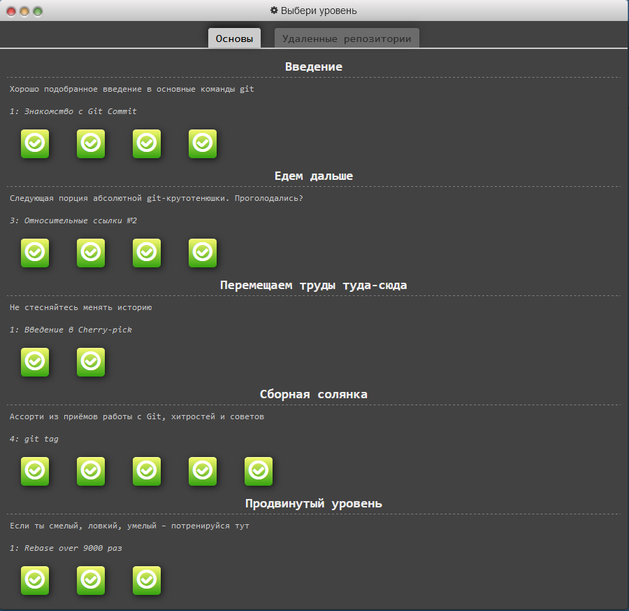

# Git & GitHub

Task screenshots

    
    

I don't know about other and theirs struggle in the course, but I can definitely say that the first task from the Stage 0 was the hardest toughest challenge in my entire IT-journey so far. It doesn't look like the one that should cause so many problems because the lectures about git was so easy, the game was hard and the task looks like it was designed to make me quit this niche once and for all. If there is an _IT-god_ and he decide to make a game which could cause an infinite suffering, than it would be the game. If there is an IT-devil who can make you suffer even worse it's the first "clone task".
Still I have learned something new but it looks like I haven't understandy many of that so at least (I hope, I really do) I could pull this story to you.

## Linux CLI, and HTTP

Task screenshots

    
    
    
    

This new chapter in my learning journey was quite curious. I've learned a few new cmd-comands which was new for me, it could be useful for Git and overall understanding of the command line. It's also interesting to learn a few commands for Linux OS.

The HTTP-chapter was also a new for me but the theory was a bit boring :( Can't say that it was crystal clear and interesting for me, but still I've learned some new things about cache HTTP-requests and request header and bodies.

## Git Collaboration

Screenshot of the task

    
    

Everythig about Git was new for me. Again, it was quite difficult to handle the game (learnbraching).

## Intro to HTML and CSS
The easiest part from the course so far! 
 

Coursera teacher did make a good lectures which are understandable and even a bit funny. There were things which are new for me, especially about the positioning and float CSS properties. I have learnt many things about media-queries and adaptive design.

Week 1

    

Week 2

    

 

The last part of the learning task was the most exciting so far! I had good practical experience with everything what I have learnt in this part of the stage.

Codecademy

    

## Responsive Web Design
It was the most exciting part of the course so far! The games are fun and interactive which is definitely great! I especially liked the additional (Flexbox Zombies) game!
The most confusing was the Grids. I'm still not sure that I can handle them properly.

Adaptive Web Design

    
    

